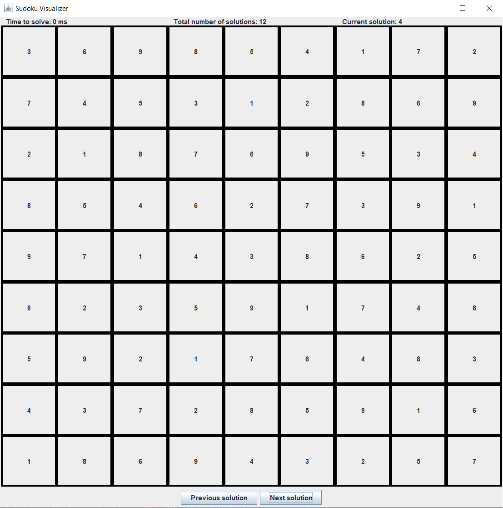

# Sudoku Solver

  
  Sudoku solver with visualization of the solutions. Modify the fields in the solve class and run its main method to solve sudokus.  
 
  ###   
  
  
  The solving algorithm uses bitfields to speed up the solving process. Here is a quick summary of the idea behind it: 
  
  I mainly used bitfields to store the possibilities of every spot in a separate 2D array (the possibilities matrix), and modified that array every time I added a new number to  the sudoku grid. As pure brute force backtracking is way too slow to solve a 5x5 grid, I implemented some iterative rules to reduce runtime,  which can be divided into two phases: insertion and filtering. For the insertion phase, the algorithm fills the cells with unique possibilities (1 rule), and iterates over the grid to add the numbers that can only go in one spot by the rules of the game (2 rules, one for numbers that only fit in one spot of a given row/column, and the other for numbers that only fit in one spot of a given sub-grid). For the filtering phase, the algorithm restricts the numbers that can go in certain cells by applying the corresponding bitmasks on the possibilities matrix (2 rules, one that checks if a given number only fits in one spot of a given row/column in a sub-grid and removes it from the possibilities matrix of the rest of the that row/column, and the other that finds pairs of cells in a given sub-grid that can only take on the exact same pair of values and removes those values from the possibilities matrix of the rest of the rows/columns on which the 2 cells happen to be). These 5 iterative rules keep on repeating until the number of changes made for every iteration falls below a certain threshold. At that point, we enter the brute force part of the method (as below a certain threshold the iterative part of the method becomes slower than the brute force one): we first make a deep copy of both the sudoku grid and the possibilities matrix (The reason for this will become apparent later). We then find the empty cell in the grid that can take on the fewest numbers according to the possibilities matrix (To minimize the number of dead ends we reach), and insert the next number it can take in the copy of the grid while modifying the copy of the possibilities matrix accordingly. Finally, we call the solve method recursively and pass it the copies of the grid and the possibilities matrix. This way, if we reach a dead end a while later, we can just discard the copied grid / possibilities matrix passed to the child method and go back to those of the parent (Removes the need to undo the changes we performed on those two arrays when we added the wrong number in the parent call). One final feature that helped accelerate the solving is the base case of the recursion: While searching for the next empty cell with the highest priority (eg the one with the least possibilities) , if we encounter an empty cell with no possibilities according to the possibilities matrix, we directly backtrack without wasting time trying to add a few more numbers before realizing that we are at a dead end. This way we prune a significant portion of the recursion tree, boosting the runtime of the algorithm. Also, if no empty cells are found, we have our solution and can let the parent know by adding a boolean return type.  
  
  
  Here is some pseudocode to further elaborate on the above: 
  
  For storing the bitfields in the possibilities matrix, I used a system where a sequence of 1s and 0s specifies which values can go in a given spot. For example, the bitfield 001111001 specifies that a 1 can go in the spot, a 2 can't, a 3 can't, a 4 can... (from right to left):

    void initializeMatrix(){
         for(every entry in the possibilities matrix)
              store a series of N 1s, where N is the size^2 of the sudoku (9 for a 3x3)
              //As at the beginning we assume every cell can store every number

         for(every entry in the sudoku grid)
              if(entry is not 0)
                    apply the bitmask to the affected squares in the possibilities matrix (row, col, ...)
                    //Applying the bitmask means setting the corresponding digit of the bitfield to 0
     }

To demonstrate the efficiency of using bitfields, here is the pseudocode for the method that checks if a cell has a unique possibility and returns the number to add if true:

    int checkIfUnique(int row, int column){
         if(possibilities matrix at row, column has a single 1 bit)
                return the position of that 1 starting from the right
                //As the rightmost digit represents the number 1, the 2nd rightmost the number 2...

         return -1; //To say that it does not have a single possibility
    }
(So instead of going through a whole array of booleans, we just manipulate a bitfield which is less costly)

To once again show the convenience of using bitfields, this final method takes in a number as well as a row and a column that represent the coordinates at which we added the number in the sudoku grid. It modifies the possibilities matrix accordingly:

    void applyMask(int row, int column, int number){
         bitMask = !(1 << (number-1))
         //This way we get a bitfield with all 1s except a 0 at the spot corresponding to number
         //For example, if number = 5, then we shift the 1 by 4 spots to the left to get 00001000
         //We then apply the ! operator which inverts every bit to get 11110111

         for(every spot in the same row, column, submatrix){
               possibilities matrix at that spot &= bitfield
              //Logical and to set the spot corresponding to number to 0
              //This says that the number can't go there anymore
         }
    }
  
   
 The solving algorithm was inspired by the work of Kevin Coulombe which can be found here: http://byteauthor.com/2010/08/sudoku-solver/

